# Ch01-02. 컴퓨터 네트워크와 인터넷

## 네트워크와 인터넷

### 네트워크

- 종단 시스템(end system): PC나 스마트폰처럼 네트워크 송수신 주체(최종 단말, 뭔가를 보내거나 받거나)
- 프로토콜(Protocol) : 두 이종 시스템을 연결하기 위한 규약
(두 개의 서로 다른 시스템을 연결하기 위해서는 약속이 필요하다. / http도 프로토콜이다.)
- 통신을 목적으로 실제 물리적으로 선으로 연결되어 있거나 무선으로 연결됨

### 인터넷

- 회사 혹은 소규모의 네트워크에서 전세계 네트워크와 연결된 상태
- 종단 시스템은 보통 ISP(Internet Service Provider)에 의해 연결

### OSI 7계층 (Layer)

- 네트워크 구성요소를 7개의 계층으로 역할을 나눈 표준 모델(통신을 위해서 약속이 필요하듯이 이 약속을 상세하게 기술한 모델이라고 보면 된다.)
- 각 계층별 역할을 통해 통신 규격(프로토콜)을 만족
- 일부 하위계층은 하드웨어에서 구현되며 상위계층은 소프트웨어로 구현

(OSI 7계층 전에 리눅스나 유닉스가 대표적인데 이 초기 운영체제에서 연결을 위한 소프트웨어 집합을 미리 만들었었는데 그것이 TCP/IP이다.)

### TCP/IP (Transmission Control Protocol/Internet Protocol)

- OSI 7계층이 나오기전 널리 사용되던 사실상 표준 역할(표준역할을 했었다.)
- 각 계층별 역할에 따라 역할이 나누어짐

## 그밖에 자주 사용되는 용어들

### IP 주소(Address)
- 통신 자료를 최종적으로 전달하기 위해 필요한 __송/수신 위치정보__
- 보통 IPv4의 주소를 사용하며 주소 부족을 위해 IPv6가 개발됨 
  * : IPv4 : 초기에 만들어진 버전(192.168.1.3 이런 주소임), IPv6 : 이후 만들어진 버전

### 패킷 교환(Packet Switching)
- 종단간에 전송되는 데이터를 패킷(Packet)이라는 단위로 전달함
- 패킷은 네트워크를 통해 일정한 순서없이 보내지며 어떤 경로를 통해 이동되는지는 네트워크의 상황에 따라 다르다. 
  * : 패킷은 전송되는 데이터인데 이결 교환할 필요가 있어서 패킷 교환?

## 통신을 위한 기본 동작
  * : 통신하려면 이 4개의 동작이 있다. 이 4가지는 최소한의 약속? 이다. 이러한 기본적인 4가지 룰을 가지고 프로토콜이 설계된다.

### 요청(Request)
- 전송하는 종단 장치에서 상대방에 서비스를 요청한다.

### 인지(Indicate)
- 수신하는 장치에서 작업 요청(이벤트)을 확인한다.

### 응답(Response)
- 수신하는 장치에서 요청받은 작업에 대해 적절히 응답한다.

### 확인(Confirm)
- 전송 측에서 응답 데이터를 최종적으로 확인한다.

## 네트워크의 유형
* : 네트워크는 큰 단위로 묶을 수도 있고, 작은 단위로 묶을 수도 있다. 작은 단위로 묶은게 lan, 큰 단위로 묶은게 wan, wan을 다시 묶으면 internet이 되는 것이다.

## LAN (Local Area Network)
- 일정 그룹의 지역 네트워크 (집, 사무실, 학교 등)
- 소규모로 묶이며 사설망등을 구축해 연결
 
## WAN(Wide Area Network)
- 원거리 통신망으로 넓은 범위 연결(국가, 대륙 등)

## 크기 유형
- LAN < WAN < Internet 

## 네트워크 토폴로지
* : 일종의 네트워크 구성 형태

### Ring Topology
* : 기기끼리 둥글게 연결하는 것, 장점은 기기와 기기간에 연결이기 때문에 회선 설치가 수월하다는 장점이 있는데, 다만, 장비에 불량이 생겼을 경우 특정 장비로 통신하기 어렵다.
### Bus Topology
* : 하나의 메인 회선을 설치하고 그 메인회선에 모든 기기를 연결하는 형태이다. 학교 전살실 같은 경우이다.
### Star Topology
* : 일반 가정에서 많이 볼 수 있다. 허브가 있고 그 허브에 기기를 전부 연결하는 형태이다. 다만, 허브의 위치에 따라서 선을 끌어와야 해서 불편할 수도 있다. 
### Mash Topology
* : 회선의 종류가 많다, 하나의 장비가 여러개의 회선을 가지고 다수의 장비에 연결된 것이다. 그래서 실제로는 가장 빠르고, 하나 고장나도 통신이 가능하다. 문제는 이걸 구현하는 설치가 복잡하다.

# Ch01-03. 네트워크의 계층별 역할, 물리계층

## OSI 7 Layer와 TCP/IP의 관계
### OSI 7계층 vs TCP/IP
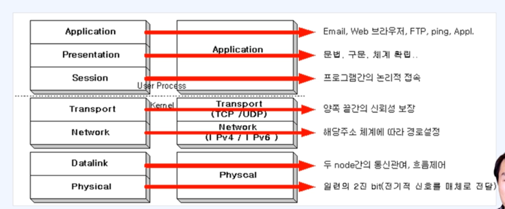
* : 네트워크 표준이 재정되기 전에 두루 쓰였던 사실상 표준이라는 TCP/IP 프로토콜 스택이 있다. 유닉스 운영체제로 출발해서 리눅스, 유닉스에서 자주 사용되던 프로토콜 스택을 기반으로 해서 다시 OSI7이라는 새로운 이론적인 모델이 만들어졌고, 그 모델이 가지고 있는 것은 어느 정도 그 계층이 매치가 된다. 
* : 가장 하위에 Physical layer : 물리 계층, Datalink, network, transport 이런 식으로 진행되고 여기에 해당하는 내용은 대부분 운영체제(Kernel)에서 담당, 나저지 Session, Presentation, Application : 이거는 운용(User Process)단에서 담당하는 부분이다.
* : 그래서 Physical layer는 가장 하위에서 2진 비트를 처리한다.
* : 데이터 링크에 해당하는 부분은 두 노드의 흐름을 제어한다. 실제 유닉스,리눅스는 이걸 다 Physical에서 다 처리했다. 
* : 네트워크계층은 주소 체계를 갖추게 된다. IP address를 갖게 된다. 이 계층에는 IPv4나 IPv6가 사용되는 계층이다.
* : Transport : 신뢰성을 보장하기 위한 TCP/UDP 프로토콜을 추가로 갖게 된다. 
* : Session, Presentation, Application : 이것들은 TCP/IP 프로토콜에서은 Application 으로 다 처리했다. 이 부분은 프로그래머가 직접 설정해서 넣어줘야 한다.
* : 그래서 OSI7 계층은 이렇게 만들면 좋다는 표준 구격을 만들어 낸 것이고, 실제로 많이 쓰이는 리눅스의 모델은 이런 형태를 취하고 있다. 이걸 하나씩 자세히 살펴보겠다.
* : 이걸 외우는 방법이 있다. 
* : 앞글자만 따서 __Please Do Not Touch Steve's Pet Alligator__ 이렇게 외우기

## 종단간의 연결
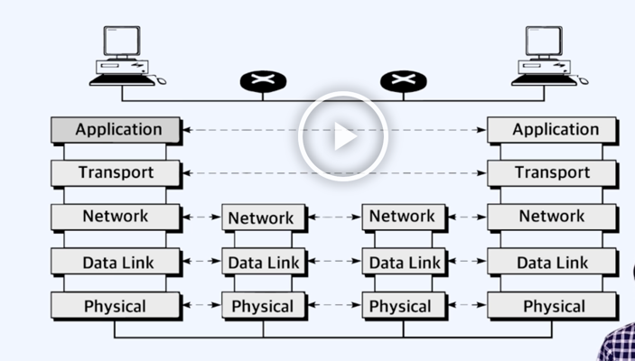
* : 이 계층이 양단의 단말기에서 어떤 방식으로 사용되냐면, 계층이사용되는 원리는 좌측에서 데이터 생성하고 우측에게 보내려고 하는데, Application을 타고 내려감, 전송계층(Session, Presentation 계층은 생략함), 일종에 해당되는 내용이 패키지처럼 쌓인다. 그러니까 네트워크로 내려가면 소포에 주소를 붙이는 것처럼 주소가 덭붙여진다. 그리고 또 내려가면 Data Link가면 하드웨어 끼리의 주소가 붙여진다. 이런식으로 계속 감싸져서 나간다.
* : Physical layer를 통하면 드디어 '10101...' 이런 형태의 물리적인 physical에서 0과 1만 존재하므로 이런 이진값으로 쭉 간다. 가다가 어디로 가야 되맂 알아야 한다. 
* : 가는 경로가 아주 많다. 경로를 파악하기 위해서 최소한 네트워크 계층까지는 열어본다 왜냐하면 주소를 알아내기 위해서,
* : 그래서 네트워크까지 올라가면서 풀어해쳐졌다가, 다시 내려가면서 감싸졌다가. 이렇게 반복하다가 
* : 결국 최종 목적지인 우측 컴퓨터에 도달한다. 
* : 그래서 각각에 레이어에 해당되는 프로토콜의 역할과 레이어의 역할이 중요하다 이것을 알아야만 컴퓨터간의 통신 원리르 파악할 수 있다. 

## 물리 계층(physical layer)

### 개요
- 물리적 매체를 통한 __비트 스트림 전송에 요구되는 기능__ 을 담당(__기계적, 전기적, 전송매체__)
  - : 비트 스트림은 비트를 보내는 과정을 말한다., 기계적이고, 전기적, 통신 매체를 가지고 통신하는 것이기 때문에 우리가 어떤 물리적인 회선, 안테나 이런 식으로 물리계층이 가지고 있는 처리를 해줘야 한다.
- 물리적 장치와 인터페이스가 전송을 위해 필요한 기능과 처리절차 규정

### 물리 층의 주요 기능
- 인터페이스와 매체의 물리적인 특성 : 장치와 전송매체 간의 인터페이스 특성을 규정
- __비트의 표현__ : 비트를 전송하기 위해 전기적 또는 광학적인 신호로 부호화
- __데이터 속도__ : 신호가 유지되는 비트의 주기를 규정
- __비트의 동기화__ : 송신자와 수신자는 같은 __클록__ 을 사용
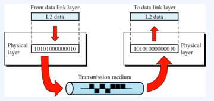
- : 물리층의 기본적인 transmission medium : 안테나, 회선 같은 것들을 말한다. 이 물리 계층에서 이진 표기법으로 무언가를 채워 넣으려면 이것을 비트로 표현하는 방법, 그다음에 데이터의 속도(왜냐하면 무한정 빠를 수 없다 상대가 받아들일 정도의 속도여야 한다.) 서로 동기가 맞아야 한다 그래서 비트의 동기화
- : 그래서 클록이라는 개념이 들어가서 클록이 얼마나 빠른지에 따라서 거기에 맞춰서 비트 데이터를 받아들인다.
- : 그래서 위(data link layer)에서 내려 오는 것을 감싸는 것이고 다시 위로 올릴때는 풀어해쳐서 올려주는 방식이다.

## 물리 계층을 다루기 위한 하드웨어 칩
### CS8900A의 예
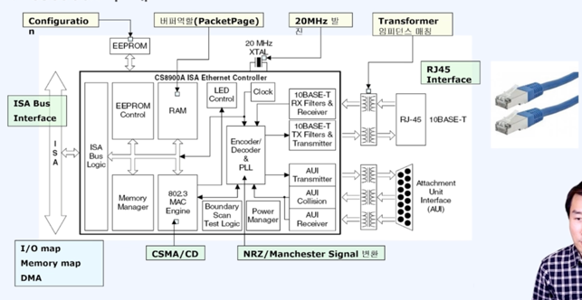
- : 물리 계층의 대표적인게 이런 하드웨어 칩이다. 물리적으로 비트를 보내고 해당 소프트웨어에 따라서 주파수를 발생할 수 있는 장치등이 칩에 존재한다.
- : 예를 들어서 이더넷 칩이고 CS8900A가 대표적인데, 이 잭을 컴퓨터 뒷면에 꼽고 이 회선을 통해서 데이터가 왔다갔다 하는 것,
- : 이 전기 신호를 리시버가 받고, 인코더, 디코더를 통해서 해석하는 방식이다. 

## 물리계층을 위한 프로토콜
### MAC(Medium Access Control) 필요
- 자유경쟁(선착순)
  - Aloha
  - Slotted Aloha - 간격 할당
  - CSMA(Carrier Sense Multiple Access)
  - CSMA/CD(CSMA/Collison Detection)
- Token
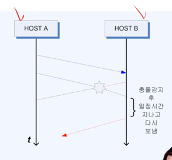
- : 우리가 뭔가 보낼때 상대방도 동시에 보내면 안된다 충돌이 발생하므로 그래서 회선을 경쟁적으로 사용하는 것이다.
- : 그리고 이 경쟁을 위한 알고리즘이 Aloha ~ CSMA/CD 가 존재한다. 우리는 최종적으로 CSMA/CD를 이더넷에 채용하서 사용한다. 
- : CSMA/CD는 충돌을 감지한 다음에 일정 시간이 지나고 다시 보내느 형태이다.

### CSMA/CD -> IEEE 802.3
- 한 slot의 크기 잼 신호 = 51.2 us = 64byte 전송소요 시간
- 16번까지 재시도

# Ch01-04. 데이터 링크 계층, 네트워크 계층의 역할

## 데이터 링크 계층(data link layer)
### 개요
- 노드 대 노드 전달(node-to-node delivery)의 책임
### 기능
- 프레임 구성 : 네트워크 계층으로부터 받은 비트 스트림을 프레임단위로 나눔
- 물리주소 MAC(Medium Access Control)지정 : 송신자와 수신자의 물리 주소를 헤더에 추가
- 흐름제어 : 수신자의 수신 데이터 전송률을 고려하여 데이터 전송하도록 제어
- 오류제어 : 손상 또는 손실된 프레임을 발견/재전송, 트레일러를 통해 이루어짐
- 접근제어 : 주어진 어느 한 순간에 하나의 장치만 동작하도록 제어
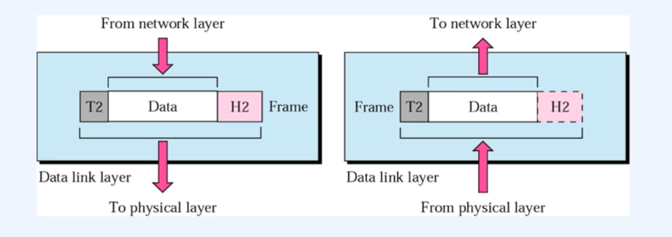
  - : 실제로 통신이 일어나므로 가장 기초적인 주소인 물리주소가 필요하다
  - : 그래서 송신자, 수신자가 필요하고 물리주소를 헤더로 만들어서 그림의 H2안(헤더)에 넣어 둔다.
  - : 상위계층에서 내려올때 이 물리 주소를 덧붙인 다음에 필요한 흐름제어, 오류제어, 접근제어 과 같은 내용을 덧붙여서(이건 trailer(T2)(꼬리)에 보내는 것 같다) 보내는 것이다.
  - : 반대로 올라올 때는 헤더를 벗겨보고 어디로 갈지를 파악해낼 수 있다. 
  - : 그래서 실제로는 MAC 데이터 링크 계층에허 흐름제어, 오류제어, 접근제어를 위해서 뭔가 추가 비트가 있는데, 
  - : 흐름은 데이터 전송률을 고려하여 전송해야 하고, 오류제어는 오류가 생기면 오류 발견하고 재전송하게 하고, 접근 제어는 한 순간에 하나의 장치만 동작하도록 제어한다. 
  - : 다음은 물리주소를 어떻게 얻을 수 있는지 두가지 프로토콜을 보겠다.

## 데이터 링크 계층에서 사용하는 주요 프로토콜
### ARP(Address Resolution Protocol)
- 주소를 해석하기 위한 프로토콜
- 논리적인 IP주소를 물리적인 MAC 주소로 바꾼다.
- 캐시를 통해 얻은 정보가 저장되고 보통 20분의 수명을 가진다.
  - : 상대방의 Ip 주소는 있지만 상대방의 MAC 주소를 알아내기 위해서 IP주소를 가지고 논리적인 MAC 주소로 알아낸다.
  - : 이렇게 알아내면 이 정보를 캐시에 저장해놓는다.(20분동안) 만일에 오랫동안 통신을 안하면 캐시 정보를 없앤다.

### RARP(Reserve Address Resolution Protocol)
- 역 주소 프로토콜
- 저장 장치가 없는 네트워크 단말기등이 IP 주소를 얻기 위해 사용
  - : 저장 장치가 없는 경우 사용한다. 네트워크 단말기 같은 경우는 저장공간이 없기 때문에 rarp를 통해서 알아낼 수 있다.

## 데이터 링크 - 노드 대 노드(Hop-to-Hop)의 전달 책임
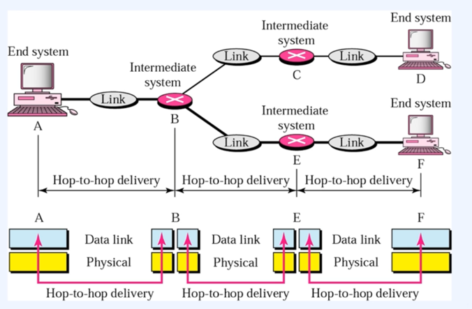
- : 노드대노드는 hop-to-hop이라고도 한다. A, B 이런 것들 하나가 노드이다. 노드와 노드 끼리의 통신을 data-link에서 책임지는 것이다.
- : 그래서 A에 있던게 B로 가면 최소한 다음 노드가 무엇인지 알 수 있다 왜냐하면 MAC 주소가 있기 때문에 그래서 C로 안가고 E로 간다. 

## 데이터 링크 계층의 전달요소
### 물리주소의 데이터 전달 과정
- 물리주소 10인 노드는 물리주소 87인 노드에 프레임을 보낸다.
  - Ex) 07:01:02:01:2C:4B
    - : 물리 주소는 이렇게 생겼다. 
- 데이터 링크 수준에서 이 프레임은 헤더에 물리주소들을 가지고 있다. 여기서는 오직 이 주소들만 필요하다.
- 헤더의 끝에는 이 수준에서 필요한 다른 정보가 있다. 트레일러에는 보통 오류검출을 위한 추가 비트들이 포함되어 있다.
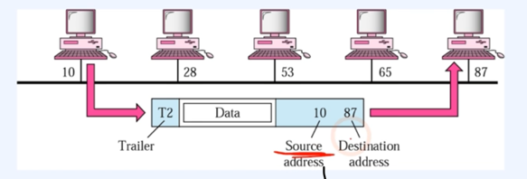
  - : 10이 source address라고 하고, 87이 목적지라고 하자. 즉 물리주소 10과 87이 존재하고 10이 87에 데이터를 보내는 것이다. (헤더를 보고)

## 네트워크 계층(network layer)
### 개요
- 패킷을 __발신지-대-목적지__ 전달에 대한 책임을 가짐
### 기능
- 발신지-대-목적지 정달(packet)
- __논리 주소지정(Logical addressing)__
  - 상위 계층에서 받은 패킷에 발신지와 목적지의 논리주소를 헤더에 추가
- 라우팅(Routing)
  - 패킷이 최종 목적지에 전달될 수 있도록 경로를 지정하거나 교환가능
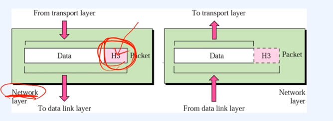
  
- : 네트워크 계층에서 할일은 바로 발신지-대-목적지(source-destination) 그래서, 논리 주소가 가능해진다.
- : 논리주소는 맥 주소랑 다르다. MAC 주소는 디바이스 식별 주소이고, 논리주소는 상대방이 누구인지, 기기, 기기를 막 거쳐서 상대방이 어디있는지 알아내는 것이다.
- : 그러니까 Ipv4와 ipv6가 된다.
- : 이 주소를 어딘가에 담아야 된다 그게 바로 네트워크 레이어의 헤더를 통해서 주소를 담는다
- : 네트워크 헤더에 들어 있는 논리 주소를 추가하고, 그 다음에 네트워크에는 라우팅 이라는 것을 한다. 라우팅은 경로를 지정해서 이걸 붙인다음 아래 계층에 내려가는 것이다.
- : 반대로 올라올 땐느 맥을 까보고, 헤더(H3)을 까면 여기에 IPadress가 있는 것이다. 밑에서는 프레임이라고 불렀는데 여기서는 packet이라고 부른다. 보통 우리가 ip 전달 체계로 보내는 묶음을 packet이라고 부르고 있다. 

## 네트워크 계층의 주요 프로토콜
- ICMP(Internet Control Message Protocol)
  - 에러 발생 시 에러 발생 원인을 알려주거나 네트워크 상태를 진단해주는 기능
- IGMP(Internet Group Management Protocol)
  - 호스트(컴퓨터)가 멀티캐스트 크룹 구성원을 인접한 라우터에게 알리는 프로토콜
- IP(Internet Protocol) *****
  - 네트워크 기기에서 논리적 식별을 위한 주소
    - IPv4: 약 40억개의 주소 Ex) 123.321.234.232
    - IPv6: 2의 128제곱의 개수를 가진 주소
      Ex) 21DA:00D3:0000:2F3B:02AA:00FF:FE28:9C5A
- : IP가 가장 대표적이다. ipv4와 ipv6로 나뉜다. ipv4가 모자라서 ipv6가 나왔다. 
- : 경로로 이동할때 오류가 발생할 수 있어서 ICMP는 특정 에러 발생하면 원인을 알려주고 네트워크 상태를 진단해주는 기능 
- : IGMP : 특정 컴퓨터가 보내고자하는 그룹 구성원 멀티캐스트라고 하는 그룹 구성원을 묶어서 보내는 프로토콜이다. (이런 프로토콜은 다음장에서)

## 네트워크 계층 - 발신지 대 목적지 전달
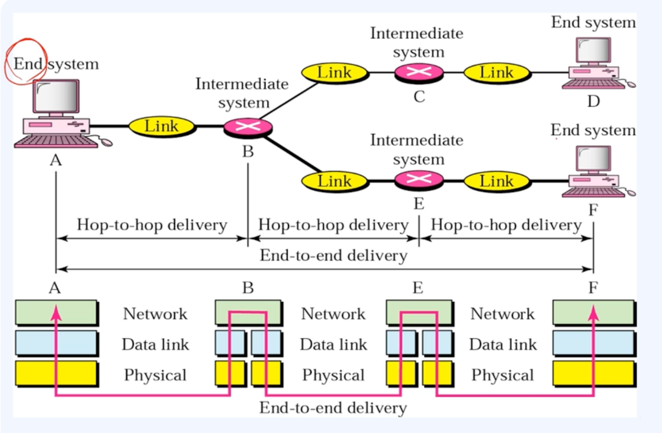
- : end to end 통신이 가능해 졌다. a에서부터 f까지 가는 책임을 가지게 된다. 
- : 중간에 라우터들은 최소한 네트워크까지는 열어본다. 그 이상은 열어볼 필요가 없다 왜냐하면 그 이상은 소프트웨어가 해야 한다. 

## 네트워크 게층의 전달 흐름
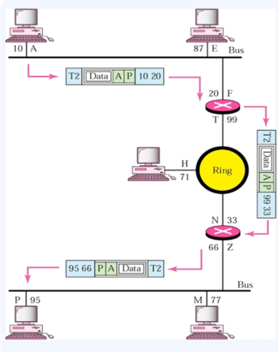
- 네트워크 주소는 A이고 물리주소가 10인 노드로부터 다른 근거리 통신망에 위치한 네트워크 주소가 P이고, 물리 주소가 95인 노드로 데이터를 보낸다.
- 두 장치는 다른 네트워크에 위치해 있기 때문에 주소(link address)만 사용할 수 없다.
- 링크 주소는 자기 지역에서만 의미가 있다. 이제 필요로 하는 것이 __근거리 통신망의 경계를 지나서도 전송할 수 있는 전역적인 주소이다.__ 네트워크(논리) 주소인 IP 주소가 이 역할을 하고 있다.
- : 이렇게 네트워크가 서로 다른데 보낼 수 있는 이유는 ip address이다.
- : 하지만 최소한 우리가 무언가를 물리적으로 보낼 때는 물리 주소가 필요하다. 

