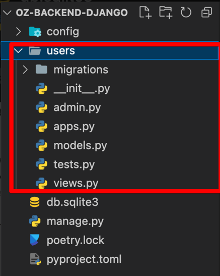

# 모델
장고는 모델, ORM, Rest API 이 3개 개념이 중요하다.

모델의 정규화 정도는 프로그램의 규모에 따라서 빠르게 만들 수도 있다.

## Model 개념

### (1) 모델이란?

- DB에서 하나의 테이블과 같은 개념
    - 인스타그램
        - 유저
        - 게시글
        - 스토리
        - 메세지
- Django의 Model을 통해 SQL 없이도 데이터 베이스 생성 및 수정이 가능하다.
- 객체지향 프로그래밍
    - 프로그램의 코드를 한 줄 한 줄 작성하여 명령시키는 것(크롤링 할 때 기억 나시나요!?)이 아닌 모델이라는 객체를 사용해서 프로그램에 명령을 내리는 방식
    - 모델이라는 객체를 사용해서 프로그램에 명령을 내리는 방식


### (2) app 생성

(1) startapp 명령어 실행
```zsh
poetry shell # 가상 환경 접속
python manage.py startapp users
```


- users 폴더가 생성
- 파일 구조
    - admin.py: 관리자 페이지 관련
    - apps.py: 메인 파일
    - models.py: 모델 관련 파일
    - views.py: 화면을 그려주는 파일

(2) modesl.py, admin.py파일 확인

modesl.py

- # Create your models here.

admin.py

- # Register your models here.

(3) users/modesl.py 수정

```python
from django.db import models

class User(models.Model): # Model을 상속받는다
	name = models.CharField(max_length=20) # 짧은 문장
	description = models.TextField() # 긴 텍스트 문장
	age = models.PositiveIntegerField() # 양의 정수형 숫자 
	sex = models.CharField()
	# is_business = modesl.
```

디버깅: models가 import 되지 않는 경우

[[Python] poetry를 사용하는 프로젝트를 vscode에서 개발할 때 interpreter를 잡는 방법 | by amazingguni | Medium](https://amazingguni.medium.com/python-poetry%EB%A5%BC-%EC%82%AC%EC%9A%A9%ED%95%98%EB%8A%94-%ED%94%84%EB%A1%9C%EC%A0%9D%ED%8A%B8%EB%A5%BC-vscode%EC%97%90%EC%84%9C-%EA%B0%9C%EB%B0%9C%ED%95%A0-%EB%95%8C-interpreter%EB%A5%BC-%EC%9E%A1%EB%8A%94-%EB%B0%A9%EB%B2%95-e1806f093e6d)

(4) config/settings.py에 users app의 존재에 대해 알려주기

```python
INSTALLED_APPS = [
    "django.contrib.admin",
    "django.contrib.auth",
    "django.contrib.contenttypes",
    "django.contrib.sessions",
    "django.contrib.messages",
    "django.contrib.staticfiles",
		"users.apps.UsersConfig" # startapp을 해줄 때 생성됨 => users/app.py 체크
]
```

(5) users/admin.py
```python
from django.contrib import admin
from .models import User

# Register your models here.
class UsersAdmin(admin.ModelAdmin):
		pass
```

저장을 해준 뒤 admin 페이지로 이동해보자.
Users가 추가된 것을 볼 수 있다.

Users를 클릭해서 이동해보면

- users_user라는 테이블을 찾을 수 없다는 오류


(6) 생성한 모델을 DB에 migrate해주기

1.makemigrations
```zsh
> poetry shell
> python manage.py makemigrations
```

*makemigrations:

- 새로 생성한 모델 또는 모델의 데이터에 변경사항이 있을 때 Django에게 알려주는 역할

2.migrate

```jsx
python manage.py migrate
```

*migrate:

- Django에 알려준 새로 생성한 모델 또는 변경된 모델에 대한 데이터를 DB에 적용시키는 명령어


위 내용을 반영 후 admin 페이지로 이동해 보면 아래와 같은 페이지로 변경된 것을 보실 수 있습니다.


User를 생성/수정/제거 하는 모든 것이 코드 몇 줄로 해결이 된 것


- users ⇒ is_business: 비즈니스 계정 여부를 알 수 있는 값을 추가해봅시다.
- boards, stories, messages 3개의 모델 추가하기

[Model field reference | Django documentation | Django (djangoproject.com)](https://docs.djangoproject.com/en/4.1/ref/models/fields/)

## 3.Admin Panel 관리

(1) 패널에 보이는 이름 관리


```python
# users/models.py

def __str__(self):
	return self.name
```

(2) 테이블의 컬럼 추가


```python
# users/admin.py

list_display = ["name", "age", "sex", "is_business"]
```

(2) 필터 추가

```python
list_filter= ["sex", "is_business"]
```

(3) 검색 기능 추가

```python
search_fields = ["name"]
```

최종코드

```python
# users/admin.py

from django.contrib import admin
from .models import User

# Register your models here.
@admin.register(User) # UsersAdmin에 등록할 Model 지정 (Decorator)
class UsersAdmin(admin.ModelAdmin): # ModelAdmin을 상속
	# pass
    list_display = ["name", "age", "sex", "is_business"]
    list_filter= ["sex", "is_business"]
    search_fields = ["name"]
```

## Custom User 업데이트 (1)

[Customizing authentication in Django | Django documentation | Django (djangoproject.com)](https://docs.djangoproject.com/en/4.1/topics/auth/customizing/)


- 이미 장고에서 제공하는 비밀번호 해쉬화, 비밀번호 저장 등의 기능을 굳이 직접 만들지 않고, 있는 기능을 활용하기

(1) users/models.py 수정

```python
# users/models.py
from django.contrib.auth.models import AbstractUser

class User(AbstractUser):
	pass
```

(2) config/settings.py

```python
AUTH_USER_MODEL = "user.User"
```

(3) users/modesl.py

```python
from django.contrib.auth.models import AbstractUser

class User(AbstractUser):
	pass
```

(4) users/migrations 폴더에서 0001,0002…로 시작하는 파일 삭제 / db.sqlite3 삭제

(5) 다시 migrate 해주기

```python
> python manage.py makemigrations
> python manage.py migrate
```

(6) user create

```python
> python manage.py createsuperuser
```

## Custom User 업데이트 (2)

(1) users/models.py 업데이트

```python
class User(AbstractUser):
	# pass
    first_name = models.CharField(max_length=150, editable=False)
    last_name = models.CharField(max_length=150, editable=False)
    name = models.CharField(max_length=150)
    is_business = models.BooleanField()
```

columns값들이 변경되었기 때문에 makemigrations를 해줘야 합니다.

```python
> python manage.py makemigrations
```


- 기존에 username, email, first_name, last_name 컬럼이 존재하고, 데이터(rows)도 존재하는 상황에서
- 행을 추가하려고 하니
- 그럼 기존에 존재하던 데이터 값의 is_business는 어떻게 해야하니?
    - (1) 기존 값에 기본값을 넣던가
    - (2) 기존 값을 설정하던가

```python
> python manage.py makemigrations
```


- 기존에 존재하던 데이터의 name 값은 어떻게 하니?
    - (1) 기존 값에 데이터를 넣던가
    - (2) 기본 값을 설정하던가


django admin 패널로 이동하면 아래의 오류가 발생


- fields를 사용해서 first_name, last_name 표시 X

```python
# users/admin.py
@admin.register(User)
class CustomUserAdmin(UserAdmin):
    fieldsets = None
    fields = ("email", "password", "name")
```

```python
from django.contrib import admin
from django.contrib.auth.admin import UserAdmin

@admin.register(User)
class CustomUserAdmin(UserAdmin):
    fieldsets = (
        ("Profile", {
                "fields": ("password", "name", "email", "is_business"),
                "classes": ("wide",),
            },
        ),
        ("Permissions",{
                "fields": (
                    "is_active",
                    "is_staff",
                    "is_superuser",
                    "user_permissions",
                ),
            },
        ),
        ("Important Dates", {
                "fields": ("last_login", "date_joined"),
                "classes": ("collapse",),
            },
        ),
    )

    list_display = ("username", "email", "name", "is_business")
```

## Foreign Key를 활용하여 여러 개의 모델 연결시키기

###