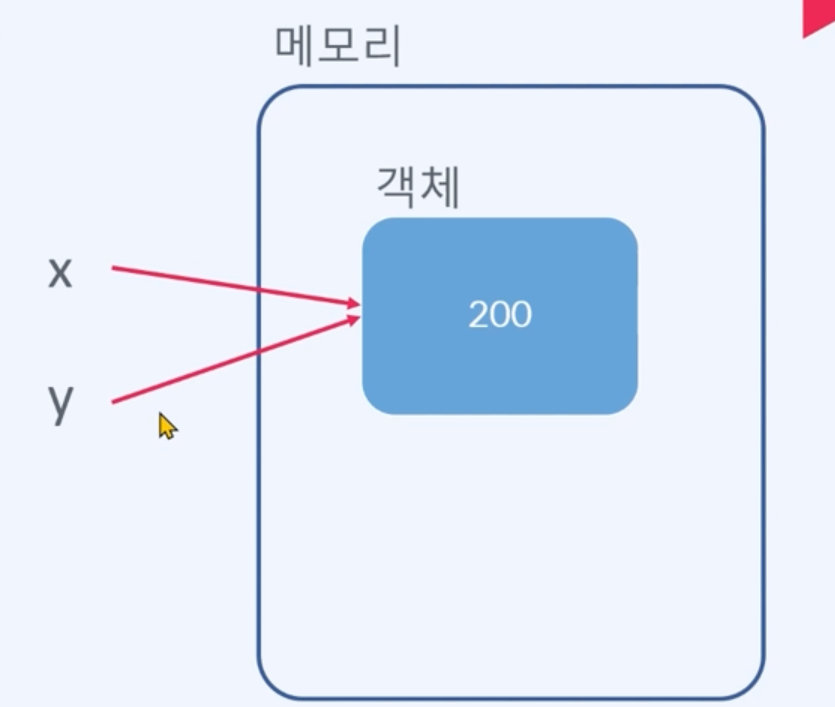
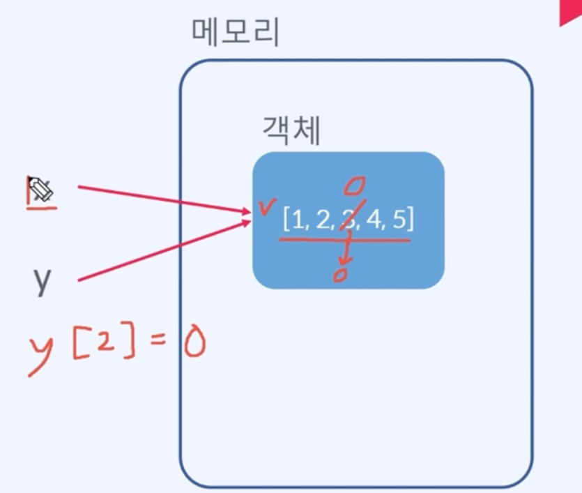

# 1. 문자열 다루기

- 문자열을 다루는 중요한 메서드 학습

### 소문자를 대문자로 바꾸는 방법

```python
>>> "be happy".upper()
'BE HAPPY'
```

### 대문자를 소문자로 바꾸는 방법

```python
>>> "LOVE".lower()
'love'
```

### 문자열 바꾸는 방법 *****

```python
>>> "오늘 날씨는 흐림 입니다.".replace("흐림", "맑음")
'오늘 날씨는 맑음 입니다.'
```

### 문자열 위치 찾는 방법

```python
>>> "hello World".find("World")
6
```

### 문자열 개수 세는 방법

```python
>>> "This cat is my cat".count("cat")
2
```

### 문자열 분리하는 방법 *****

```python
>>> '나이키신발 265 x253 880'.split()
['나이키신발', '265', 'x253', '880']
>>> '나이키신발:265:x253:880'.split(':')
['나이키신발', '265', 'x253', '880']
```

### 문자열 연결하는 방법 *****

```python
>>> ''.join(['나이키신발','233','333'])
'나이키신발233333'
>>> ':'.join(['나이키신발','233','333'])
'나이키신발:233:333'
```

### 공백 삭제하는 방법 *****

```python
>>> '   yeah    '.lstrip()
'yeah \t'
>>> '   yeah    '.rstrip()
'\tyeah'
>>> '   yeah    '.strip()
'yeah'
```

# 2. 문자열 포매팅

### format 메서드

‘{인덱스}’.format(데이터)

```python
>>> 'Hello {0}'.format('coding')
'Hello coding'
# 인덱스 생략가능
>>> 'Hello {}'.format('coding')
'Hello coding'
```

### f-string

```python
name1 = 'apple'
name2 = 'pineapple'
name3 = 'pen'

msg = f'Hello {name1}{name2}{name3}'
print(msg)
```

# 3. 리스트 다루기

## 리스트에 데이터 추가

```python
fruits = ['apple', 'orange']
fruits.append('grape')
print(fruits)
```

## 리스트에 리스트 추가

```python
fruits = ['apple', 'orange']
fruits.append(['grape', 'mango'])
print(fruits)
#--==>> ['apple', 'orange', ['grape', 'mango']]
```

## 리스트 데이터 삭제

```python
fruits = ['apple', 'orange', 'mango']
print(fruits.pop())
#--==>> mango
print(fruits)
#--==>> ['apple', 'orange']
```

## 리스트 데이터 삭제(인덱스 이용)

```python
fruits = ['apple', 'orange', 'mango']
print(fruits.pop(0))
#--==>> apple
print(fruits)
#--==>> ['orange', 'mango']
```

## 리스트 데이터 삭제(데이터 이용)

```python
fruits = ['apple', 'orange', 'mango']
print(fruits.remove('orange'))
#--==>> None (반환값 없음)
print(fruits)
#--==>> ['apple', 'mango']
```

## 리스트 특정 값의 인덱스 구하는 방법

```python
fruits = ['apple', 'orange', 'mango']
print(fruits.index('orange'))
#--==>> 1
```

## 리스트 특정 값의 개수 구하는 방법

```python
fruits = ['apple', 'orange', 'mango', 'apple', 'apple']
print(fruits.count('apple'))
#--==>> 3
```

## 리스트 모든 요소 삭제 방법

```python
fruits = ['apple', 'orange', 'mango', 'apple', 'apple']
fruits.clear()
print(fruits)
#--==>> []
```

## 리스트 정렬하기

```python
numbers = [3, 54, 4, 2, 9]
numbers.sort()
print(numbers)
#--==>> [2, 3, 4, 9, 54]
```

### for in 반복문 사용할 때 인덱스같이 출력하는 방법

```python
numbers = [5, 2, 8, 1, 10]

for index, number in enumerate(numbers):
    print(index, number)
"""
0 5
1 2
2 8
3 1
4 10
"""
```

### 예제

```python
# 리스트 메서드

# 리스트 데이터 삭제
fruits = ['apple', 'orange', 'mango']
del fruits[1]
print(fruits)
#--==>> ['apple', 'mango']

# 리스트 정렬
numbers = [5, 1, 8, 3]
numbers.sort()
print(numbers)
#--==>> [1, 3, 5, 8]

# enumerate
titles = ['출석!!', '출석인증합니다!', '출석이요!!']

for index, title in enumerate(titles, 1): # 이렇게하면 1번 인덱스부터 시작
    print(f'{index} 번째 글입니다. 제목: {title}')
"""
1 번째 글입니다. 제목: 출석!!
2 번째 글입니다. 제목: 출석인증합니다!
3 번째 글입니다. 제목: 출석이요!!
"""
```

# 4. 리스트 내포

## 리스트 내포란?

for문, if문 등을 지정하여 리스트를 간편하게 만드는 것

## for문 사용하기

- [표현식 for 변수 in 순회가능한 데이터]

```python
nums = [i for i in range(5)]
print(nums)
#--==>> [0, 1, 2, 3, 4]

nums = [100, 200, 300]
double_nums = [i * 2 for i in nums]
print(double_nums)
#--==>> [200, 400, 600]

nums = [i for i in range(10) if i % 2 == 0]
print(nums)
#--==>> [0, 2, 4, 6, 8]
```

- [표현식 for 변수 in 순회가능한 데이터 if 조건식]

```python
nums = [i for i in range(10) if i % 2 == 0]
print(nums)
#--==>> [0, 2, 4, 6, 8]

nums = [100, 200, 300, 400]
double_nums = [i * 2 for i in nums if i >= 300]
print(double_nums)
#--==>> [600, 800]
```

# 5. 리스트 내포 실습문제

## 실습문제 2.4.1

리스트 내포를 사용해서 word_list에 들어 있는 문자열 중 첫 글자가 a인 것만 뽑아서 만드세요.

변경 전
[’apple’, ‘watch’, ‘apolo’, ‘star’, ‘abocado’]

변경 후
[’apple’, ‘apolo’, ‘abocado’]

```python
word_list = ['apple', 'watch', 'apolo', 'start', 'abocado']

# 리스트 내포 사용하기 전
result = []
for word in word_list:
    if word[0] == 'a':
        result.append(word)
print(result)

# 리스트 내포 사용한 후
new_list = [i for i in word_list if i[0] == 'a']
print(new_list)
```

## 실숩문제 2.4.2

리스트 내포를 사용해서 다음과 같이 변경해보자.

변경 전
[’오메가3’, None, ‘비타민C’, None, ‘홍삼절편’]

변경 후
[’오메가3’, ‘비타민C’, ‘홍삼절편’]

이건 크롤링할 때 많이 사용할 수 있다.

```python
items = ['오메가3', None, '비타민', None, '홍삼절편']

# 리스트 내포 사용 전
result = []
for item in items:
    if item != None:
        result.append(item)
    else:
        result.append('')
print(result)
#--==>> ['오메가3', '', '비타민', '', '홍삼절편']

# 리스트 내포 사용 후
result = [i if i != None else '' for i in items]
print(result)
#--==>> ['오메가3', '', '비타민', '', '홍삼절편']
```

# 5. 할당과 복사
## 학습 목표
- 파이썬에서는 데이터도 객체이다.
- 리스트(딕셔너리) 할당과 복사의 차이점

## 파이썬에서는 데이터도 객체이다!!
- 변수에 데이터가 저장된다. 
- : 이 말은 사실이 아니다.
- 변수가 데이터를 가리킨다.
    x = 200
    y = 200
  - : x라는 변수에 200이 저장되고 y라는 변수에 200이 저장되는 것이 아니다.

  - : 메모리에 객체 200이 존재하고 그 객체를 x와 y가 가르키는 것이다. 숫자 데이터를 활용할 때는 문제가 되지 않는데 리스트에서는 문제가 된다.

## 리스트 할당과 복사
- 리스트 할당 방식
    x = [1, 2, 3, 4, 5]
    y = x

  - : 객체 1,2,3,4,5 리스트를 만들고 이걸 x가 가리키고 y도 따라서 가리키는 것이다. 이러면 어떤 문제가 발생하냐면 y를 x의 복사본으로 생각하기 쉽다. 하지만, y를 수정하면 객체 자체가 바뀌면서 x도 바뀌는 문제가 발생한다. 
### 예제
```python
# 리스트 할당 방식 

x = [1,2,3,4,5]
y = x
y[2] = 0
print(x)
print(y)
print(id(x))
print(id(y))
"""
[1, 2, 0, 4, 5]
[1, 2, 0, 4, 5]
4379260096
4379260096
"""
```

- 리스트 복사 방식
x = [1,2,3,4,5]
y = x.copy()
- : 이렇게 해야 다른 객체가 생성되서 x와 y가 다른 객체를 가리킨다.

- 다차원 리스트 복사 방식 
x = [[1,2], [3,4,5]]
import copy
y = copy.deepcopy(x)
- : 다차원 리스트는 그냥 copy로 복사할 수 없고, deepcopy로 복사해야 한다.
```python
# 리스트 복사 방식
a = [5,6,7,8,0]
b = a.copy()
b[2] = 0
print(a)
print(b)
print(id(a))
print(id(b))
"""
[5, 6, 7, 8, 0]
[5, 6, 0, 8, 0]
4344657664
4344900288
"""

# 중첩 리스트 복사 방식
import copy
c = [[1,2], [3,4,5]]
d = copy.deepcopy(c)
d[0][0] = 0
print(c)
#--> [[1, 2], [3, 4, 5]]
print(d)
#--> [[0, 2], [3, 4, 5]]
```
  
