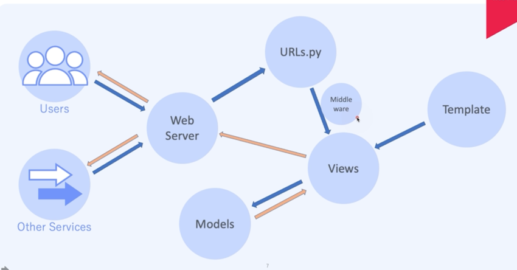
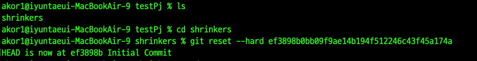

# Django 웹프레임워크의 이해

- Batteries Included
    : 우리가 생각하는게 무엇이든 장고 안에 존재하고, 커뮤니티안에 존재한다.
- 다양한 사용이 가능
- 안전하다.
- Shared-nothing Architecture 
- Very Maintainable

## 프레임워크 vs 라이브러리
Serving : 고객의 요청이든, enter 키든 이런 트리거가 있으면 서빙을 한다.
### 프레임워크
#### 내코드 -> Django -> Serving
: 서빙을 하는데 있어서 프레임워크가 서빙을 하는 주체이다. 장고가 우리에게 화면을 띄어주는 주체이지 내 코드가 주체가 아니다. 

### 라이브러리
#### 라이브러리 -> 내 코드 -> Serving
: 라이브러리는 반대이다. 내 코드가 서빙 하는데 주체이다. 


## Django의 구조

: 파란선 : request 노란선 : response
: 유저나 다른 서비스가 웹 서버로 요청한다. 요청한걸 웹 서버에서 받아서 urls.py로 보낸다. 
유효한 url인지 확인하고, views로 보낸다. 입출력이 있으면 models로 가서 입출력을 진행하고, 
렌더링이 필요하면 template에 있는 코드를 가져와서 view가 템플릿 코드를 html로 변환해서 바로 웹서버로 통해서 유저와 다른 서비스에게 보낸다. 
우리가 여기서 봐야하는 것은 model view template이다. 장고는 mvt 패턴을 쓰고 있다!
또한 우리는 미들웨어도 추가할 것이다. 유효한 url이 있다면 view로 넘어가기 전에 미들웨어 타고 넘어가는 것이다 그러면 로깅도 할 수 있고, 인증도 할 수 있고 모든 트레픽을 감시할 수 있다.


# Django 프로젝트 생성
## PEP8 Coding Convention
여러 사람이 협업을 해도 모두가 읽기 편한 코드를 작성하기 위한 기본 규칙(하지만, Local Rule이 더 중요하다!)

- 한 줄의 문자열은 79자
- DocString은 72자
- snake_case 사용
- 모듈 레벨 상수는 모두 대문자
- ClassName은 Capitalized Word
- 한 줄로 된, if, try...except, for, while 구문은 사용하지 않는다.

장고에서는
- 한 줄의 문자열은 119자 추천
- DocString은 72자

## PEP 20 - Zen to Python
가장 중요한 것은 가독성이 중요하다. 


# Database Modeling

## DB 모델링이란?
어떤 Item에 속성 데이터를 사전에 정의하는 것.

### Django 에서는?
- Django 에서 id는 기본 값 (Primary Key) 정의 하지 않아도 자동 정의
- 외래키(Foreign Key)를 사용하면 뒤에 xxx_id를 자동으로 생성
  - Job에 위치를 추가하고 싶은데 해당 위치가 다른 테이블에 있다면 location으로 정의해주면 location_id로 데이터 컬럼이 생성됨

### Django DB 컬럼 타입
* CharField (길이가 정해진 문자열)
* IntegerField (-2147483648 ~ 2147483647)
* PositiveIntegerField : 양수만 사용할 때
* BigIntegerField (-9223372036854775808 ~ 9223372036854775807) 
* PositiveBigIntegerField
* DateField (날짜)
* DatetimeField (날짜 + 시간)
* BooleanField (True/False)
* TextField (길이가 정해지지 않은 문자열)
* EmailField (이메일 포멧)
* JSONField (Json 포멧)
* AutoField (Auto Increment 필드 with IntegerField)
* BigAutoField (Auto Increment 필드 with BigIntegerField) : django의 기본적인 pk id 타입이다.
* ForeignKey (다른 테이블 PK 참조 필드)
예제) shortener/models.py
```python
from django.db import models


class PayPlan(models.Model):
    name = models.CharField(max_length=20)
    price = models.IntegerField()
    updated_at = models.DateTimeField(auto_now=True)
    # auto_now=True : 매번 업데이트 될때 현재 시간을 넣어준다.
    create_at = models.DateTimeField(auto_now_add=True)
    # auto_now_add=True : 이 컬럼이 처음에 생성될 때 현재 시간을 넣어 준다.
```


이렇게 매 프로젝트 진행함

## UserData 추가
```python
from django.db import models

from django.contrib.auth.models import AbstractUser
from django.contrib.auth.models import User


class PayPlan(models.Model):
    name = models.CharField(max_length=20)
    price = models.IntegerField()
    updated_at = models.DateTimeField(auto_now=True)
    create_at = models.DateTimeField(auto_now_add=True)


# 1
class Users(AbstractUser):
    pay_plan = models.ForeignKey(PayPlan, on_delete=models.DO_NOTHING)
# AbstractUser : 현재 가지고 있는 user를 추상화해서 거기에 pay_plan을 넣겠다는 것이다. 이 방법도 있고, 


# 2
class UserDetail(models.Model):
    user = models.OneToOneField(User, on_delete=models.CASCADE)
    pay_plan = models.ForeignKey(PayPlan, on_delete=models.DO_NOTHING)
# 이 방법처럼 UserDetail 메소드를 만들어서 onetoonefield로 유저가 가지고 있는 추가 정보를 넣어주는 방법도 있다.
```
# 1번 방법은 한 테이블에 쌓이고, 2번 방법은 두 테이블에 쌓인다. 어떤게 더 좋은지는 프로젝트 마다 다르다. 만약 처음에 abstractuser를 만들었다면 1번 그대로 해고, 
# abstractuser를 안만들고 django 기본 모델을 사용하다가 나중에 user 추가 데이터를 넣고 싶으면 2번 방법을 사용하면 된다.

# 단, 1번 방법을 하면 settings.py에 INSTALLED_APPS 위에 AUTH_USER_MODEL = "shortener.Users"적는다 -> shortener의 user테이블을 사용한다고 명시해 줘야 한다. 
# user테이블을 상속받으면서 user 테이블이 쓸모가 없어지기 때문에 인증을 위해서 어떤 테이블을 사용할 것인지, 어떤 DB를 쓸건지 정리해줘야 한다. 

# 2번은 django가 가지고 있는 User 모델을 import 했고, 이 User와 user모델을 onetoone필드로 1대1 매핑이 되도록 한다는 뜻이다.
# 그래서 user 데이터를 추가로 저장할 수 있다. 그래서 pay_plan을 추가로 저장하겠다는 것이다. 그리고 1,2번 둘다 활성화 해도 된다.


